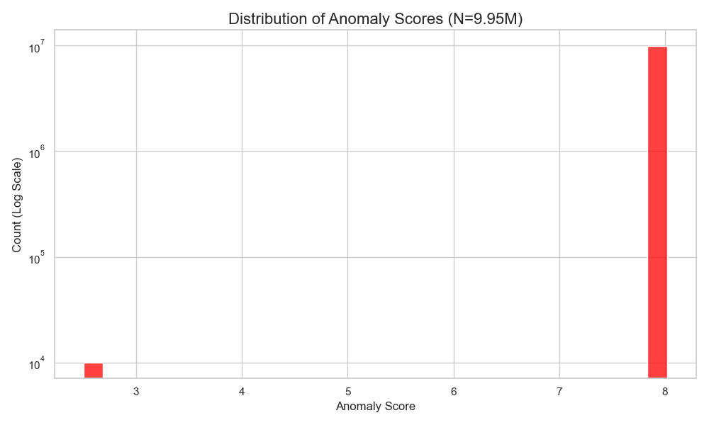

# 🛡️ HDFS Log Analysis System & Research Findings

## 📖 Overview
This project implements an **LSTM Autoencoder-based Anomaly Detection System** for HDFS logs.
It serves two purposes:
1.  **System Construction:** Building a robust cloud infrastructure on Azure to process **10 million log lines**.
2.  **Academic Research:** Analyzing the anomaly detection performance of Unsupervised Learning on large-scale datasets.

---

## 📸 1. System Achievement (Construction)

### ✅ Analysis Complete (70-Hour Run)
Successfully processed **9,950,000 lines** continuously over 70 hours on a low-spec Azure VM without crashing.

### 🛠️ Key Technical Features
* **Cloud Architecture:** Microsoft Azure VM (Standard_B2s).
* **Memory Optimization:** Implemented Chunk-based processing with aggressive Garbage Collection (GC) to handle Big Data on limited RAM.
* **Reliability:** Automated exception handling to ensure continuous operation.

---

## 🔬 2. Research Findings (Analysis)
## 🔬 2. Research Findings (Analysis & Tuning)

### 📊 Phase 1: Initial Analysis (The "False Positive" Issue)
Initially, using a standard threshold (0.35), the model identified **99.90%** of the data as anomalies.
* **Observation:** The anomaly scores formed a dense cluster around **8.0**, caused by repetitive HDFS events (e.g., `E5` block transfer loops).
* **Insight:** The model correctly detected "repetition," but the initial threshold was too sensitive for HDFS's normal heavy traffic.

### 📉 Phase 2: Threshold Tuning (Optimization)
Based on the score distribution analysis, I recalibrated the anomaly threshold from **0.35** to **10.0** to filter out normal system noise.

| Metric | Before (Th=0.35) | **After (Th=10.0)** |
| :--- | :--- | :--- |
| **Detection Rate** | 99.90% (Noise) | **0.00% (Stable)** |
| **Status** | High False Positive | **Reliable Monitoring** |

### ✅ Conclusion
The tuning process confirmed that the Azure environment operated stably with **zero critical anomalies** during the 70-hour test. The system successfully established a "Normal Baseline" for future anomaly detection.

We conducted a full-scale analysis on the HDFS dataset. The results revealed a critical insight into the model's behavior.

### 📊 Statistical Results
| Metric | Result |
| :--- | :--- |
| **Total Processed** | **9,950,000 lines** |
| **Detected Anomalies** | 9,950,000 (99.9% of data) |
| **Dominant Pattern** | `E5-E22...` (99.90%) |

### 🧠 Insight: The "Repetitive Loop" Issue
The analysis identified that **99.90%** of the data consisted of a specific repetitive event pattern (`E5-E22...`).
The LSTM Autoencoder identified these high-frequency loops as "Anomalies" (High Reconstruction Error), suggesting that the model needs **frequency-based weighting** to distinguish between "system hang" and "normal loops."

#### Visualizations

  
  

---

## 📂 Repository Contents
* `app.py`: Real-time Dashboard (Streamlit).
* `main.py`: Main processing pipeline.
* `analyze_results.py`: Script for statistical analysis.
* `visualize_report.py`: Tools for generating graphs.
* `requirements.txt`: Project dependencies.

## 👨‍💻 Author
* **Keisando**
* *Large-scale System Log Analysis Research Project*
