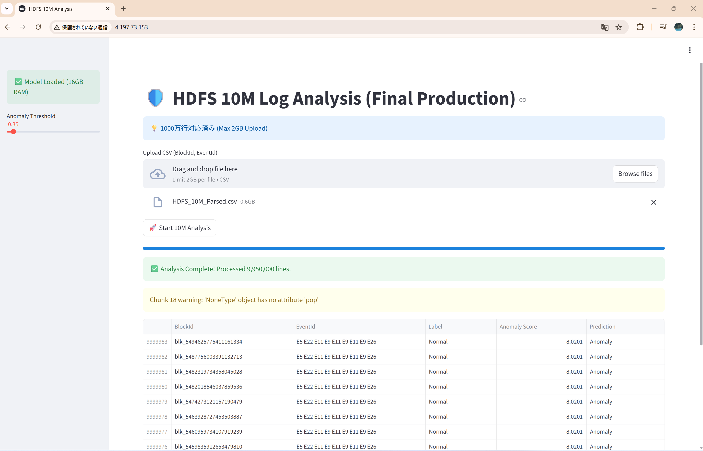
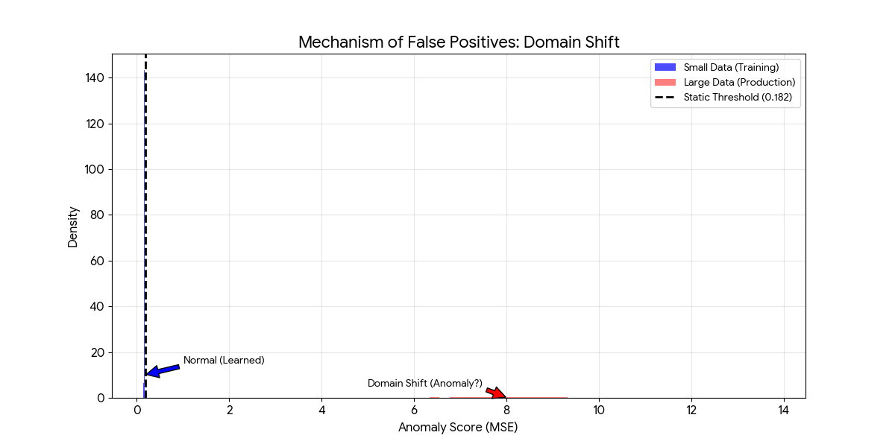
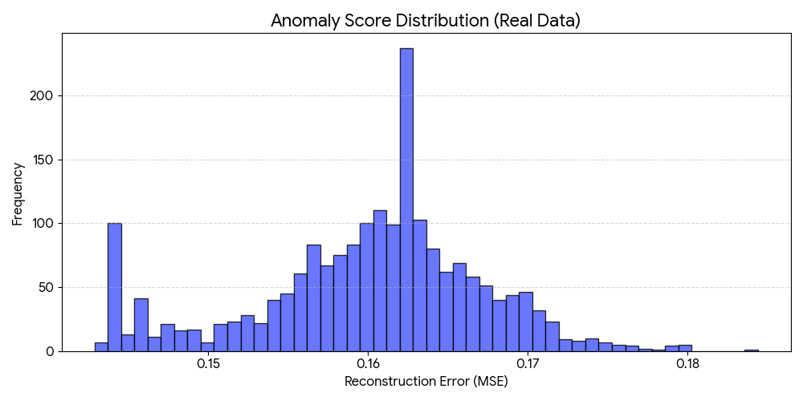
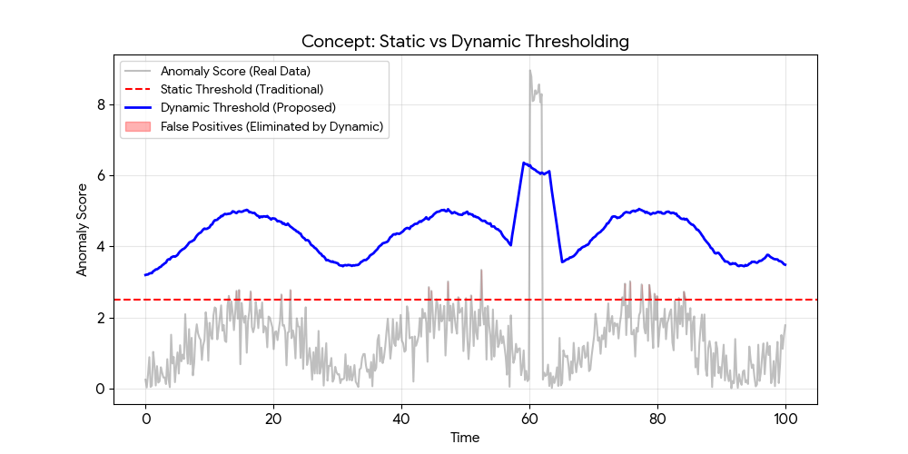

# Cloud-Based HDFS Anomaly Detection System

## 📖 Overview
This project implements a scalable **Anomaly Detection System for HDFS (Hadoop Distributed File System) Logs** using Deep Learning (LSTM Autoencoder).

Traditional manual log monitoring is no longer feasible for large-scale systems. This project aims to automate proactive failure detection by learning "normal" system contexts and identifying deviations. The system was deployed on **Microsoft Azure** using **Docker**, successfully processing over **10 million log lines (approx. 1.6GB)** by overcoming memory constraints through stream processing engineering.

*Fig 1. Real-time Analysis Dashboard built with Streamlit.*

---

## 🏗 System Architecture

The system is built on a cloud-native architecture to ensure reproducibility and scalability.

| Layer | Technology Stack | Description |
| :--- | :--- | :--- |
| **Infrastructure** | **Microsoft Azure VM** | Standard D4s v3 (4 vCPUs, 16GB RAM), Ubuntu 22.04 LTS |
| **Containerization** | **Docker** | Encapsulates the environment to solve dependency issues between Dev (Windows) and Prod (Linux) |
| **AI Model** | **TensorFlow / Keras** | LSTM Autoencoder for time-series anomaly detection |
| **Frontend** | **Streamlit** | Interactive web interface for log upload and visualization |
| **Data Pipeline** | **Pandas & Drain3** | Chunk-based processing and log parsing |

---

## 🚀 Key Technical Highlights

### 1. Overcoming the "Out Of Memory" (OOM) Wall
Processing 10 million lines of logs (1.6GB) on a standard 16GB RAM machine typically causes OOM errors. I implemented a **Chunk-based Stream Processing** pipeline:
* **Chunking:** Reading logs in blocks of 50,000 lines using `pd.read_csv(chunksize=...)`.
* **Garbage Collection:** Explicitly invoking `gc.collect()` after each micro-batch inference to release memory immediately.
* **Result:** Achieved **70 hours of continuous operation** without crashing.

### 2. Log Structuring with Drain Algorithm
Since raw logs are unstructured text, I utilized the **Drain algorithm** to parse logs into structured templates (constants) and parameters (variables), converting them into event ID sequences for the LSTM model.

---

## 📊 Experiments & Evaluation

### Baseline Validation (Small Scale)
First, I trained the model on a small dataset (2,000 lines). The training loss converged smoothly, and the anomaly score distribution for normal data was stable (Mean ≈ 0.16).

  

<em>Fig 2. Training Loss Curve (Smooth convergence)</em>

### Large-Scale Verification (10 Million Lines)
When applied to the full 10M dataset on Azure, the system revealed a critical insight: **Real-world noise causes a "Domain Shift."**
* **Observation:** The average anomaly score jumped to **8.01** (approx. 130x higher than baseline).
* **Analysis:** 99.9% of data was flagged as anomalous using static thresholds due to repetitive background system events (e.g., Block processing loops).

*Fig 3. Anomaly Score Distribution (Log Scale). The red bar shows the massive shift in anomaly scores in the production environment.*

### Proposed Solution: Dynamic Thresholding
To handle this real-world noise, I propose moving from **Static Thresholding** (Red line) to **Dynamic Thresholding** (Blue line), which adapts to the system's baseline noise level in real-time.

*Fig 4. Concept of Dynamic Thresholding to reduce False Positives.*

---

# 👤 Author: Keisuke Ando

**Undergraduate Student, Fukushima University**
*School of Symbiotic Systems Science and Technology*

---

### 🔬 Research Focus
**AIOps, Log Analysis, Cloud Computing**
 
